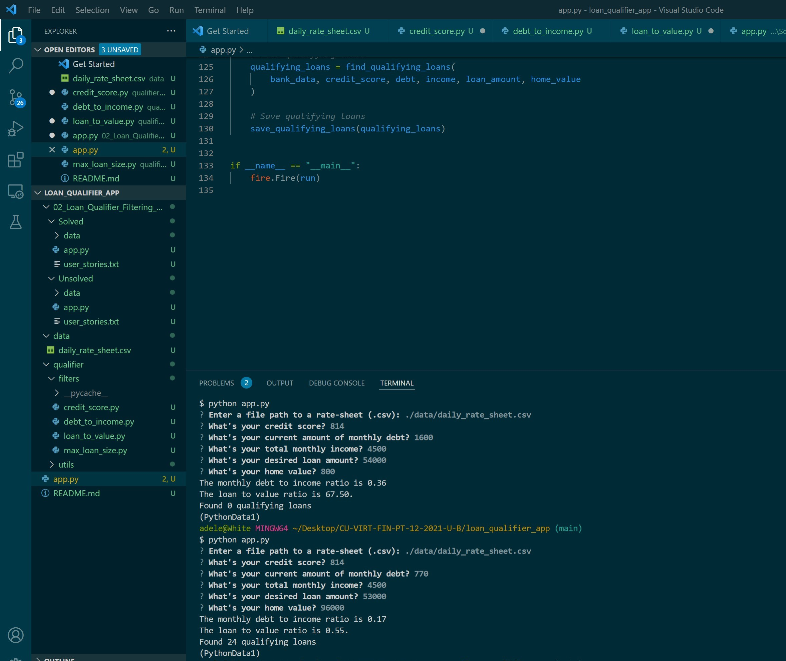

## Project Title
### vehicle/dealership loan match project

With the relatively low federate interests(before the consecutively increased fed interest rate forehead), more individuals tend to apply for loans for cars, etc to seize the low-interest rate benefits.
and with the long-term car chips shortage, the market of dealerships is in high demand for the purchaser who has been waiting for the empty inventory list. 

Hence, this project is to launch a loan match to bridge the car dealership financial manager as a user to boost the sales and enlarge the benefits for both dealership and their representing brands with relatively potential manageable loan risk, and further help those borrowers to match for the most desired lenders from a dail_rate_sheet database. 

This project will contribute to the dealership as sale side and car buyers as buy-side in this post covid period, as a boost for the stagflation of the global economy, especially for the car industry, and might further help with the transitioning from gasoline to electrical vehicles with more gathered information in sales. 

---

## Technologies

### programming languages: python, git bash, excel,
 
### libraries core library in app.py:
import sys
import fire
import questionary
from pathlib import Path
import csv

from qualifier.utils.fileio import load_csv

from qualifier.utils.calculators import (
    calculate_monthly_debt_ratio,
    calculate_loan_to_value_ratio,
)

from qualifier.filters.max_loan_size import filter_max_loan_size
from qualifier.filters.credit_score import filter_credit_score
from qualifier.filters.debt_to_income import filter_debt_to_income
from qualifier.filters.loan_to_value import filter_loan_to_value 

### frameworks and requirement of version control:
check the requirements.txt for detailed or attached below

absl-py==1.0.0
altair==4.2.0
asn1crypto==1.5.1
astunparse==1.6.3
async-generator==1.10
attrs @ file:///home/conda/feedstock_root/build_artifacts/attrs_1640799537051/work
backcall==0.2.0
backports.zoneinfo==0.2.1
base58==2.1.1
beautifulsoup4==4.10.0
bip32==2.1
bip44==0.1.1
bitarray==1.2.2
bleach @ file:///home/conda/feedstock_root/build_artifacts/bleach_1629908509068/work
blinker==1.4
bokeh @ file:///D:/bld/bokeh_1637615407028/work
Bottleneck @ file:///D:/bld/bottleneck_1636024356480/work
brotlipy @ file:///D:/bld/brotlipy_1636012439160/work
bs4==0.0.1
cached-property==1.5.2
cachetools==5.0.0
Cartopy @ file:///D:/bld/cartopy_1642061236150/work
census @ file:///home/conda/feedstock_root/build_artifacts/census_1622404746346/work
certifi==2021.10.8
cffi @ file:///D:/bld/cffi_1636046306023/work
cftime @ file:///D:/bld/cftime_1642887679318/work
charset-normalizer @ file:///home/conda/feedstock_root/build_artifacts/charset-normalizer_1644853463426/work
click @ file:///D:/bld/click_1645238363756/work
cloudpickle @ file:///home/conda/feedstock_root/build_artifacts/cloudpickle_1631273254894/work
coincurve==15.0.1
colorama @ file:///tmp/build/80754af9/colorama_1603211150991/work
colorcet==3.0.0
configparser==5.2.0
crayons==0.4.0
cryptography @ file:///D:/bld/cryptography_1639699494546/work
cycler @ file:///home/conda/feedstock_root/build_artifacts/cycler_1635519461629/work
Cython==0.29.28
cytoolz==0.11.2
dask==2021.10.0
datashader==0.13.0
datashape==0.5.4
debugpy==1.5.1
decorator==5.1.1
defusedxml @ file:///home/conda/feedstock_root/build_artifacts/defusedxml_1615232257335/work
distlib==0.3.4
distributed @ file:///C:/ci/distributed_1635950227219/work
entrypoints @ file:///home/conda/feedstock_root/build_artifacts/entrypoints_1643888246732/work
eth-abi==2.1.1
eth-account==0.5.7
eth-hash==0.3.2
eth-keyfile==0.5.1
eth-keys==0.3.4
eth-rlp==0.2.1
eth-tester==0.5.0b3
eth-typing==2.3.0
eth-utils==1.10.0
filelock==3.7.0
finta==1.3
fire @ file:///home/conda/feedstock_root/build_artifacts/fire_1611345183397/work
Flask==2.1.2
Flask-SQLAlchemy==2.5.1
flatbuffers==2.0
fonttools @ file:///D:/bld/fonttools_1643722755699/work
fsspec @ file:///home/conda/feedstock_root/build_artifacts/fsspec_1645566723803/work
future @ file:///D:/bld/future_1635819645981/work
gast==0.5.3
geojson==2.5.0
geopandas @ file:///home/conda/feedstock_root/build_artifacts/geopandas_1638382567988/work
geoviews==1.9.4
gitdb==4.0.9
GitPython==3.1.27
gmaps==0.9.0
google-auth==2.6.2
google-auth-oauthlib==0.4.6
google-pasta==0.2.0
graphviz==0.19.1
greenlet==1.1.2
grpcio==1.44.0
h11==0.13.0
h5py==3.6.0
HeapDict==1.0.1
hexbytes==0.2.2
holoviews==1.14.8
hvplot==0.7.3
idna @ file:///home/conda/feedstock_root/build_artifacts/idna_1642433548627/work
imbalanced-learn==0.9.0
imblearn==0.0
importlib-metadata @ file:///D:/bld/importlib-metadata_1644934959023/work
importlib-resources @ file:///home/conda/feedstock_root/build_artifacts/importlib_resources_1635615662634/work
ipfshttpclient==0.7.0a1
ipykernel==6.9.1
ipython==7.31.1
ipython_genutils==0.2.0
ipywidgets @ file:///home/conda/feedstock_root/build_artifacts/ipywidgets_1631590360471/work
itsdangerous==2.1.2
jedi==0.17.2
Jinja2 @ file:///home/conda/feedstock_root/build_artifacts/jinja2_1636510082894/work
joblib @ file:///home/conda/feedstock_root/build_artifacts/joblib_1633637554808/work
jsonschema==3.2.0
jupyter @ file:///D:/bld/jupyter_1637233295291/work
jupyter-client==7.1.2
jupyter-console @ file:///home/conda/feedstock_root/build_artifacts/jupyter_console_1631656760380/work
jupyter-core==4.9.2
jupyterlab-widgets @ file:///home/conda/feedstock_root/build_artifacts/jupyterlab_widgets_1631590465624/work
keras==2.8.0
Keras-Preprocessing==1.1.2
kiwisolver @ file:///D:/bld/kiwisolver_1635836925049/work
libclang==13.0.0
llvmlite==0.38.0
locket==0.2.0
lru-dict==1.1.7
lxml==4.8.0
Markdown @ file:///home/conda/feedstock_root/build_artifacts/markdown_1637220118004/work
MarkupSafe @ file:///D:/bld/markupsafe_1635833748820/work
matplotlib @ file:///D:/bld/matplotlib-suite_1639359207070/work
matplotlib-inline==0.1.3
mistune @ file:///D:/bld/mistune_1635844820103/work
mnemonic==0.20
msgpack @ file:///D:/bld/msgpack-python_1637771553056/work
multiaddr==0.0.9
multipledispatch==0.6.0
munkres==1.1.4
nbconvert @ file:///home/conda/feedstock_root/build_artifacts/nbconvert_1631125953237/work
nbformat @ file:///home/conda/feedstock_root/build_artifacts/nbformat_1617383142101/work
nest-asyncio==1.5.4
netaddr==0.8.0
netCDF4 @ file:///D:/bld/netcdf4_1636303129152/work
notebook @ file:///D:/bld/notebook_1628216487410/work
numba @ file:///D:/bld/numba_1644004110248/work
numexpr @ file:///D:/bld/numexpr_1643221054461/work
numpy @ file:///D:/bld/numpy_1640083233759/work
oauthlib==3.2.0
opt-einsum==3.3.0
outcome==1.1.0
packaging @ file:///home/conda/feedstock_root/build_artifacts/packaging_1637239678211/work
pandas @ file:///C:/ci/pandas_1635506714241/work
pandocfilters @ file:///home/conda/feedstock_root/build_artifacts/pandocfilters_1631603243851/work
panel==0.12.6
param==1.12.0
parsimonious==0.8.1
parso==0.7.1
partd @ file:///home/conda/feedstock_root/build_artifacts/partd_1617910651905/work
path==16.4.0
patsy @ file:///home/conda/feedstock_root/build_artifacts/patsy_1632667180946/work
pickleshare @ file:///C:/ci/pickleshare_1594374056827/work
Pillow @ file:///D:/bld/pillow_1644499259754/work
pipenv==2022.5.2
platformdirs==2.5.2
prometheus-client @ file:///home/conda/feedstock_root/build_artifacts/prometheus_client_1643395600215/work
prompt-toolkit==3.0.28
protobuf==3.20.0
psutil @ file:///D:/bld/psutil_1640887338722/work
psycopg2==2.9.3
pyarrow==7.0.0
pyasn1==0.4.8
pyasn1-modules==0.2.8
pycparser @ file:///home/conda/feedstock_root/build_artifacts/pycparser_1636257122734/work
pycryptodome==3.14.1
pyct==0.4.8
pydeck==0.7.1
pydotplus==2.0.2
Pygments==2.11.2
pymongo==4.0.2
Pympler==1.0.1
pyOpenSSL @ file:///home/conda/feedstock_root/build_artifacts/pyopenssl_1643496850550/work
pyparsing @ file:///home/conda/feedstock_root/build_artifacts/pyparsing_1642753572664/work
pypiwin32==223
pyproj @ file:///D:/bld/pyproj_1636547899808/work
PyQt5==5.12.3
PyQt5_sip==4.19.18
PyQtChart==5.12
PyQtWebEngine==5.12.1
pyrsistent @ file:///D:/bld/pyrsistent_1642534576941/work
pysha3==1.0.2
pyshp @ file:///home/conda/feedstock_root/build_artifacts/pyshp_1644593068012/work
PySocks @ file:///D:/bld/pysocks_1635862618120/work
python-dateutil==2.8.2
python-dotenv==0.20.0
python-utils==3.1.0
pytz @ file:///home/conda/feedstock_root/build_artifacts/pytz_1633452062248/work
pytz-deprecation-shim==0.1.0.post0
pyviz-comms==2.1.0
pywin32==303
pywinpty @ file:///D:/bld/pywinpty_1643992610567/work/target/wheels/pywinpty-2.0.2-cp37-none-win_amd64.whl
PyYAML @ file:///D:/bld/pyyaml_1636139977724/work
pyzmq==22.3.0
qtconsole @ file:///home/conda/feedstock_root/build_artifacts/qtconsole-base_1640876679830/work
QtPy @ file:///home/conda/feedstock_root/build_artifacts/qtpy_1643828301492/work
questionary @ file:///home/conda/feedstock_root/build_artifacts/questionary_1626352221002/work
requests==2.27.1
requests-oauthlib==1.3.1
rlp==2.0.1
rsa==4.8
scikit-learn @ file:///D:/bld/scikit-learn_1640464434301/work
scipy @ file:///C:/bld/scipy_1637806996411/work
seaborn @ file:///home/conda/feedstock_root/build_artifacts/seaborn-split_1629095986539/work
selenium==4.1.2
semantic-version==2.9.0
semver==2.13.0
Send2Trash @ file:///home/conda/feedstock_root/build_artifacts/send2trash_1628511208346/work
Shapely==1.8.0
six==1.16.0
smmap==5.0.0
sniffio==1.2.0
sortedcontainers @ file:///home/conda/feedstock_root/build_artifacts/sortedcontainers_1621217038088/work
soupsieve==2.3.1
splinter==0.17.0
SQLAlchemy==1.4.31
statsmodels @ file:///D:/bld/statsmodels_1644535845397/work
streamlit==1.8.1
ta==0.9.0
tblib @ file:///home/conda/feedstock_root/build_artifacts/tblib_1616261298899/work
tensorboard==2.8.0
tensorboard-data-server==0.6.1
tensorboard-plugin-wit==1.8.1
tensorflow==2.8.0
tensorflow-io-gcs-filesystem==0.24.0
termcolor==1.1.0
terminado @ file:///D:/bld/terminado_1643296842540/work
testpath @ file:///home/conda/feedstock_root/build_artifacts/testpath_1621261527237/work
tf-estimator-nightly==2.8.0.dev2021122109
threadpoolctl @ file:///home/conda/feedstock_root/build_artifacts/threadpoolctl_1643647933166/work
toml==0.10.2
toolz @ file:///home/conda/feedstock_root/build_artifacts/toolz_1636177962100/work
tornado==6.1
tqdm @ file:///home/conda/feedstock_root/build_artifacts/tqdm_1632160078689/work
traitlets==5.1.1
trio==0.20.0
trio-websocket==0.9.2
typing-extensions==3.10.0.2
tzdata==2022.1
tzlocal==4.2
unicodedata2 @ file:///D:/bld/unicodedata2_1640031276438/work
urllib3 @ file:///home/conda/feedstock_root/build_artifacts/urllib3_1641584929973/work
utils==1.0.1
validators==0.18.2
varint==1.0.2
virtualenv==20.14.1
virtualenv-clone==0.5.7
watchdog==2.1.7
wcwidth @ file:///tmp/build/80754af9/wcwidth_1593447189090/work
web3==5.17.0
webdriver-manager==3.5.3
webencodings==0.5.1
websockets==8.1
Werkzeug==2.1.1
widgetsnbextension @ file:///D:/bld/widgetsnbextension_1637174326849/work
win-inet-pton @ file:///D:/bld/win_inet_pton_1635832912576/work
wrapt==1.14.0
wsproto==1.1.0
xarray @ file:///home/conda/feedstock_root/build_artifacts/xarray_1639125986756/work
zict==2.0.0
zipp @ file:///home/conda/feedstock_root/build_artifacts/zipp_1643828507773/work

### operating systems
specific versions of any critical dependencies that used in the stable version of app.

Edition	Windows 11 Pro
Version	21H2
Installed on	‎4/‎8/‎2022
OS build	22000.675
Serial number	R90T7J26
Experience	Windows Feature Experience Pack 1000.22000.675.0

Processor	Intel(R) Core(TM) i7-8850H CPU @ 2.60GHz   2.59 GHz
Installed RAM	32.0 GB (31.5 GB usable)
System type	64-bit operating system, x64-based processor
Pen and touch	Pen and touch support with 10 touch points

---

### Installation Guide(check the requirements.txt for system info and python pakage version control detailed)

In this section, detailed installation notes containing code blocks or screenshots
-Download all files, please include database csv file in the data folder  
-run app.py in Any IDE, here use VS code 
-when asked "Enter a file path to a rate-sheet (.csv)" input the the local link as followed in the data folder  
  ./data/daily_rate_sheet.csv  

---

## Usage
### screenshots, code blocks, or animations explaining how to the vehicle/dealership loan match project.

<!-- -type python app.py in terminal to run the app  
 and the the app will return questions one by one:
-when asked "Enter a file path to a rate-sheet (.csv)" input the the local link as followed in the data folder  
  ./data/daily_rate_sheet.csv  
-follow the question typing in the credit score, monthly income, etc in terminal, hit enter  
-The qulifying loan information will automatically be displayed as followed and save as qualifying_loans.csv in the data folder.  
 with the The monthly debt to income ratio is e.g. 22.50  
-The loan to value ratio is e.g. 1.00.  
-The display show case of the initial test and the final saved csv file is included in the repo and attached below:   -->
.jpg)
 

 
---

## Contributors

Meina Bian

---

## License

MIT License

Copyright (c) [2022] [Meina Bian]

Permission is hereby granted, free of charge, to any person obtaining a copy
of this software and associated documentation files (the "Software"), to deal
in the Software without restriction, including without limitation the rights
to use, copy, modify, merge, publish, distribute, sublicense, and/or sell
copies of the Software, and to permit persons to whom the Software is
furnished to do so, subject to the following conditions:

The above copyright notice and this permission notice shall be included in all
copies or substantial portions of the Software.

THE SOFTWARE IS PROVIDED "AS IS", WITHOUT WARRANTY OF ANY KIND, EXPRESS OR
IMPLIED, INCLUDING BUT NOT LIMITED TO THE WARRANTIES OF MERCHANTABILITY,
FITNESS FOR A PARTICULAR PURPOSE AND NONINFRINGEMENT. IN NO EVENT SHALL THE
AUTHORS OR COPYRIGHT HOLDERS BE LIABLE FOR ANY CLAIM, DAMAGES OR OTHER
LIABILITY, WHETHER IN AN ACTION OF CONTRACT, TORT OR OTHERWISE, ARISING FROM,
OUT OF OR IN CONNECTION WITH THE SOFTWARE OR THE USE OR OTHER DEALINGS IN THE
SOFTWARE.
